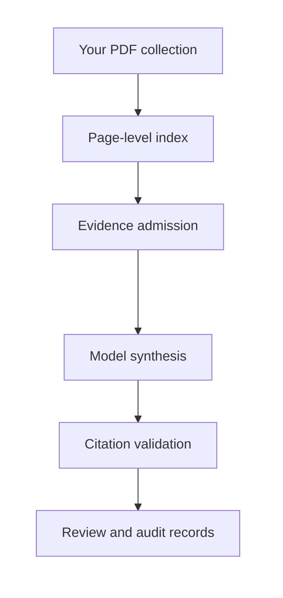

<div align="center">

<picture>
  <source media="(prefers-color-scheme: dark)" srcset="assets/rrr-logo-dark.svg">
  <source media="(prefers-color-scheme: light)" srcset="assets/rrr-logo-light.svg">
  
</picture>

# Retrieval-Restricted Reasoning

**Page-cited research synthesis from the PDFs you choose.**

RRR turns a selected collection of scholarly PDFs into claim evaluations and
literature reviews. Every released review keeps a checkable path from its prose
to the source page.

[**Install RRR**](docs/product_installation.md) · [Prepare your PDFs](docs/before_running.md) · [Cite RRR](#cite-rrr) · [Explore the source](src/rrr)

</div>

---

## Choose the materials. Ask a research question. Inspect every citation.

RRR is built for researchers, students, instructors, and research teams working
with a bounded reading list. The user defines the source collection, and RRR
keeps retrieval, evidence admission, citation rendering, and run records tied
to that collection.

| Evaluate a claim | Synthesize a literature |
| --- | --- |
| **T1** compares a statement with evidence found in the selected PDFs. | **T2** organizes relevant evidence into a page-cited literature review. |
| `$rrr t1 <claim>` in Codex | `$rrr t2 <topic>` in Codex |
| `/rrr t1 <claim>` in Claude Code | `/rrr t2 <topic>` in Claude Code |

```text
$rrr t1 Institutions are the fundamental cause of long-run economic growth.
$rrr t2 How did institutions shape long-run economic growth?
```

RRR can also run directly from a terminal.

## How RRR works



The selected model receives admitted passages from the declared collection.
RRR then resolves evidence identifiers into author, year, and page citations,
checks the released text, and records the run for later inspection.

## Start with Codex

Install the public RRR plugin once:

```bash
codex plugin marketplace add igbaccin/rrr-poc --ref main
codex plugin add rrr@rrr-poc
```

Start a new Codex task, open the folder containing your PDFs, and enter a T1 or
T2 prompt. The first invocation prepares a private RRR runtime and guides you
through corpus selection. This route uses your Codex login and subscription;
it requires Python 3.10 or later and PDFs with usable text or OCR.

The [installation guide](docs/product_installation.md) also covers Claude Code,
local Ollama models, and OpenAI or Anthropic API models.

## What a run produces

| Output | Purpose |
| --- | --- |
| `review_composed.md` | The released claim evaluation or literature review |
| `citations.json` | Parsed citation surfaces and validation outcomes |
| `review_ledger.json` | The admitted evidence available to the writer |
| `quality_manifest.json` | Release checks and document-coverage diagnostics |
| `run_manifest.json` | Models, settings, hashes, and provenance for the run |

These records support close reading of the review and reproducible comparison
across models or settings.

## One pipeline, several model routes

| Setup | Model route | Begin here |
| --- | --- | --- |
| Codex plugin | GPT through a Codex subscription | [Install the Codex plugin](docs/product_installation.md#option-1-codex-with-the-codex-subscription) |
| Claude Code skill | Claude through a Claude subscription | [Install the Claude skill](docs/product_installation.md#option-2-claude-code-with-the-claude-subscription) |
| Local terminal | Mistral or Qwen through Ollama | [Configure local use](docs/product_installation.md#option-3-local-command-line-use-with-ollama) |
| Codex or Claude with local inference | Mistral or Qwen through Ollama | [Combine a skill with Ollama](docs/product_installation.md#option-4-codex-or-claude-with-local-ollama-inference) |
| Provider API | OpenAI or Anthropic API model | [Configure API mode](docs/product_installation.md#option-5-provider-api-mode) |

Retrieval, source admission, citation validation, and audit records use the
same RRR code in every route.

## Documents and data flow

| Component | Local Ollama | Native Codex or Claude | Provider API |
| --- | --- | --- | --- |
| Original PDFs | Local | Local | Local |
| Extracted page text and search index | Local | Local | Local |
| Retrieval and source admission | Local | Local | Local |
| Citation validation and run records | Local | Local | Local |
| Language-model calls | Local Ollama | Codex or Claude subscription | OpenAI or Anthropic API |
| Admitted evidence passages sent to a provider | No | Yes | Yes |

The [before-running guide](docs/before_running.md) explains PDF requirements,
metadata sources, corpus preparation, and the human review step for uncertain
bibliographic records.

## Evaluated citation integrity

In the main evaluation condition, full RRR produced 99 integrity-clean reviews
in 100 attempts. The remaining review contained a conflated author-year
attribution that the checker rejected. Across 553 released reviews in the
validation-enabled conditions, the automated checker found no E1 through E5
citation failures.

| Code | Failure checked |
| --- | --- |
| E1 | A citation points outside the declared collection. |
| E2 | A citation points to a page that does not exist. |
| E3 | A citation has an invalid format or exposes an internal evidence identifier. |
| E4 | A quotation cannot be verified on the cited page. |
| E5 | A quotation is attributed to the wrong source. |

RRR is research software under active development. These controls evaluate
citation integrity. Users should still assess interpretation, source coverage,
and the substantive adequacy of every synthesis.

## Repository map

| Path | Contents |
| --- | --- |
| `src/rrr/` | RRR source code |
| `plugins/rrr/` | Installable Codex plugin |
| `skills/rrr/` | Portable Codex and Claude skill bundle |
| `dist/` | Installable Python wheel and SHA-256 checksum |
| `docs/` | Installation and corpus-preparation guides |
| `tests/unit/` | Automated tests for the pipeline and runtime modes |

## Cite RRR

If RRR supports your research, please cite the accompanying article. You can
also download the [BibLaTeX entry](CITATION.bib) or use the
[machine-readable citation metadata](CITATION.cff).

### BibLaTeX

```bibtex
@article{martins_rrr_forthcoming,
  author       = {Martins, Igor},
  title        = {Retrieval-Restricted Reasoning: Supporting Scholarly Synthesis with Language Models},
  journaltitle = {Historical Methods: A Journal of Quantitative and Interdisciplinary History},
  pubstate     = {forthcoming},
}
```

### APA 7th

Martins, I. (in press). Retrieval-restricted reasoning: Supporting scholarly
synthesis with language models. *Historical Methods: A Journal of Quantitative
and Interdisciplinary History*.

### Chicago

Martins, Igor. “Retrieval-Restricted Reasoning: Supporting Scholarly Synthesis
with Language Models.” *Historical Methods: A Journal of Quantitative and
Interdisciplinary History*. Forthcoming.

### Harvard

Martins, I. (forthcoming) ‘Retrieval-Restricted Reasoning: Supporting Scholarly
Synthesis with Language Models’, *Historical Methods: A Journal of Quantitative
and Interdisciplinary History*.

## Licence and contact

The source code is distributed under the terms in [LICENSE.txt](LICENSE.txt).

Questions about RRR can be directed to Igor Martins at
`igor.martins@ekh.lu.se`.
